# Architecture du Blog de Vacare

## Back-end
__**API REST, servant à la logique de l'application, architecture Laravel :**__
- **[Controllers](../src-back/app/Http/Controllers)** : Gestion des requêtes et des réponses
- **[Middleware](../src-back/app/Http/Middleware)** : Middlewares de sécurité
- **[Models](../src-back/app/Models)** : Modèles de données
- **[Routes](../src-back/routes/api.php)** : Gestion des routes
- **[Migrations](../src-back/database/migrations)** : Gestion des migrations vers la base de données
- **[docker](../src-back/docker)** : Configurations Docker

## Front-end

__**Visuels du site récupérant les données de l'API**__
- **[app](../src/BlogVacare/app/)** : Pages et routes Next.js (assemblage UI à partir des components)
- **[components](../src/BlogVacare/components/)** : Composants UI purement visuels récupérant éventuellement des données
- **[pagesclient](../src/BlogVacare/pagesclient)** : Contenu des pages à afficher
- **[contexts](../src/BlogVacare/contexts/)** : Contextes encadrant l'application entière pour des fonctionnalités communes à toutes les pages (système de connexion, gestion des modes d'affichage, ...)
- **[hooks](../src/BlogVacare/hooks/)** : permet d'appeler des données à récupérer depuis des services et de les mettre en forme ou de les réarranger pour une utilisation en components
- **[services](../src/BlogVacare/services/)** : Interactions avec un back permettant de récupérer les données demandées par le front (appels API, appels du back-end,...)
- **[utils](../src/BlogVacare/utils/)** : Helpers réutilisables (résonances en fond de page)
- **[lib](../src/BlogVacare/lib/)** : Utils de génération/configuration (routes statiques, styles et variantes du site)

- **[public/assets](../src/BlogVacare/public/assets/)** : Images, sons, vidéos, ... contenu statique du site
- **[styles](../src/BlogVacare/styles/)** : CSS, XCSS, ...

## MCD du projet

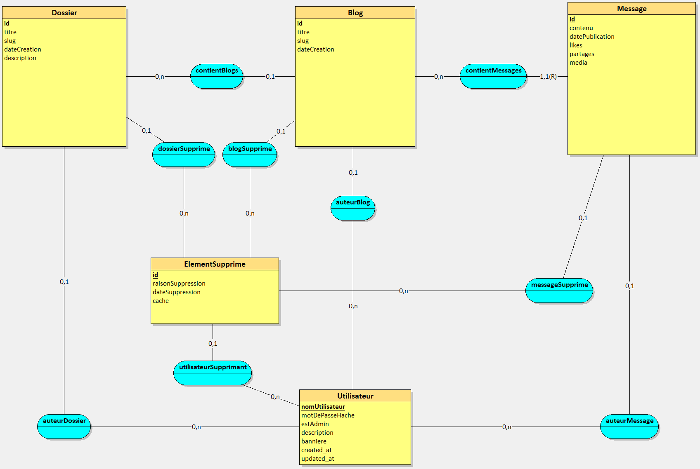

# Installation du projet

## Configuration du projet

Pour configurer votre projet, commencez par créer un fichier [.env à partir de l'exemple fourni](../src/BlogVacare/.env.sample), vous n'aurez qu'à configurer le lien du [backend](../src-back) du projet dans la ligne "NEXT_PUBLIC_LIEN_API_BACKEND".

Modes de fonctionnements du site (automatiquement configurés par [next.config.ts](../../src/BlogVacare/frontend/next.config.ts)):
* **export** :
    - Mode servant à l'exportation du site sous forme de pages HTML, nécessitant d'autres ajustements comme décrit ci-dessous (actuellement : connexion et inscription désactivés en mode exportation, le site est en "lecture seule")
    - Accessible via ```npm run build:export``` à la [racine du projet frontend](../../src/BlogVacare/frontend/), tout en ayant le backend actif et correctement lié
    - Votre projet devrait ensuite se trouver dans un dossier **out** sous forme de pages HTML.
* **Production** :
    - Mode servant à l'hébergement du site de façon dynamique (interactions en direct avec le backend, ajout et suppression de contenu, ...)
    - Accessible via ```npm run "build:BlogVacare"``` puis ```npm run "start:BlogVacare"``` ou ```npm run "buildAndStart:BlogVacare"``` pour tout exécuter à la suite, ces commandes devant être exécutées à la [racine du dépôt](../../)

## Mise en place Back-End

Pour utiliser le back-end, vous aurez besoin de Docker où installer les dépôts actuels.
```bash
# Pour lancer et initialiser le projet 
docker compose up -d

# Pour initialiser le projet 
docker compose up -d --build

# Pour arrêter le projet 
docker compose down
```

## Mise en place de la Base de Données

[Depuis le dossier du back-end](../src-back), exécutez la commande suivante :
```bash
php artisan migrate
```

# Manuel d'utilisation du Blog de Vacare

## Première découverte du site

En arrivant sur le site, vous devriez faire face à la page d'accueil suivante :
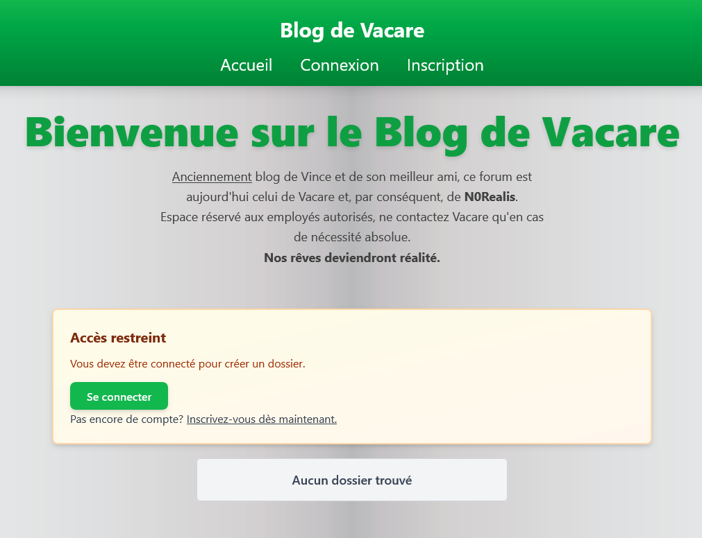

Le site se compose actuellement de **2 modes d'affichage** : Un affichage rétro (disponible sous le domaine "/old") et un affichage moderne, les 2 ayant accès à la même base de données mais affichant les éléments différemment, comme il sera décrit plus bas.

## Première inscription

Votre première étape sur le site sera de vous inscrire et de vous connecter à un premier compte : sur n'importe quelle page, cliquez sur le bouton **"Inscription"** de l'en-tête de page et entrez les données demandées.  
__Le mot de passe devra respecter certaines contraintes données sur la page concernée.__

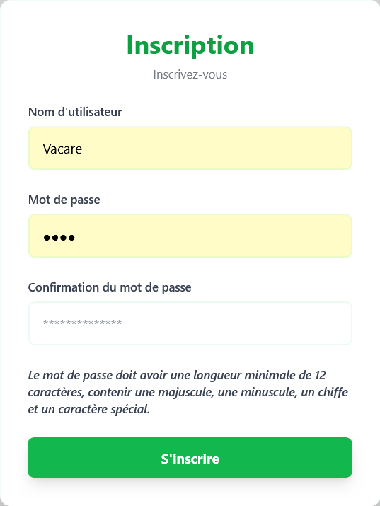

Une fois le compte créé, vous pourrez vous connecter sur la page de connexion vous redemandant votre nom d'utilisateur ainsi que votre mot de passe :

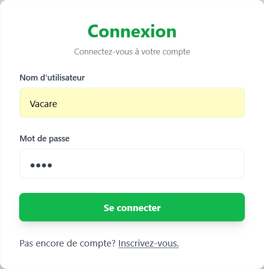

## Votre premier dossier de blogs !

L'application a une structure telle que les blogs sont stockés dans des dossiers. Vous devrez donc créer votre premier dossier afin de commencer à discuter sur cette application.

Remplissez le premier formulaire et soumettez-le afin de créer votre premier dossier :

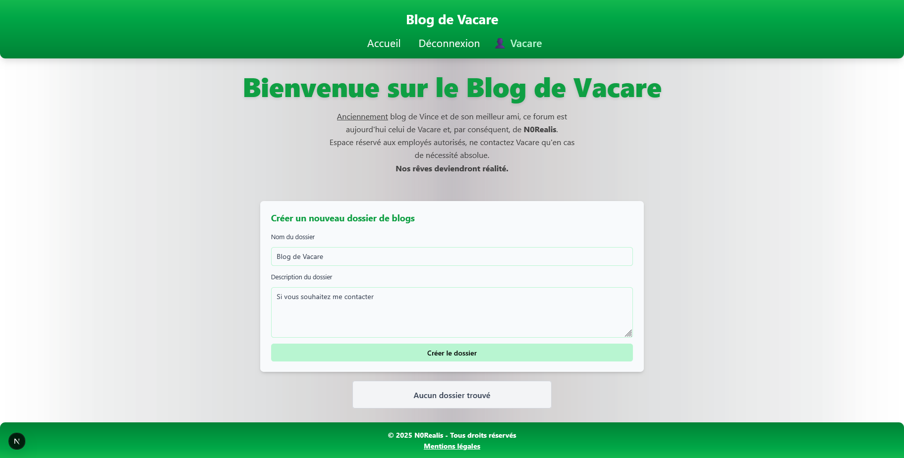

## Votre premier blog !

Vous pourrez ensuite créer votre premier blog, vous permettant d'initier la discussion avec autrui si toute sorte de sujet important vous vient à l'esprit :

Remplissez le formulaire en fournissant le nom du blog ainsi que le contenu du premier message de celui-ci :

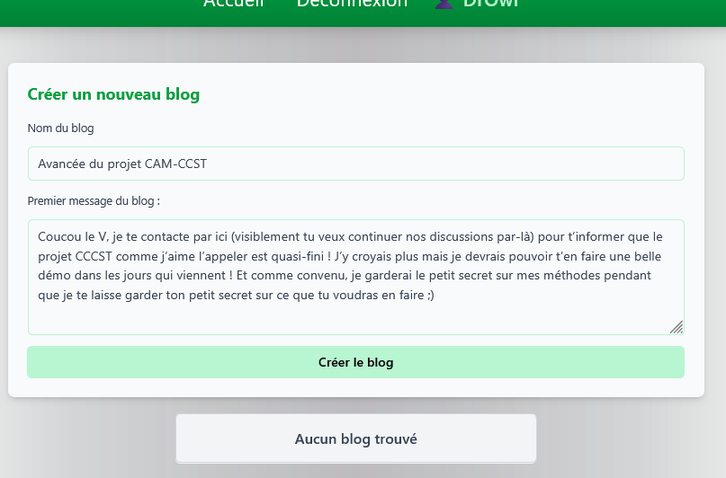

Vous pourrez ensuite répondre autant que vous le voudrez à ce blog en remplissant simplement le formulaire en bas de page :

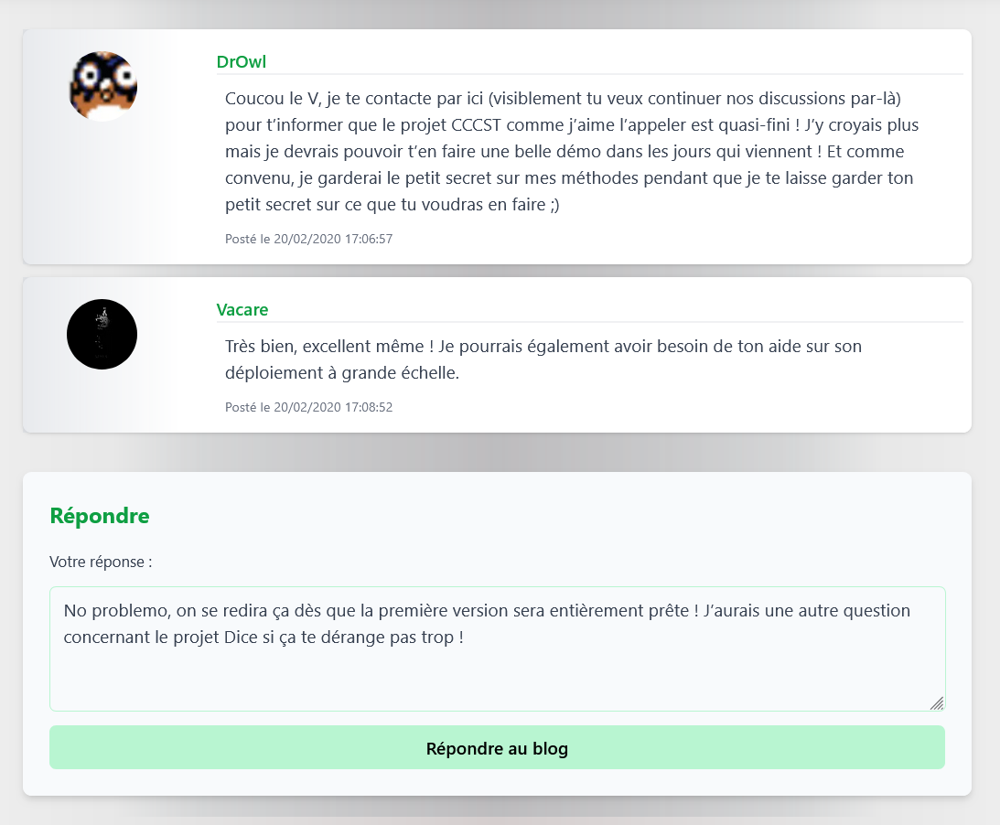

## Supprimer un message (Admin)

Si vous êtes administrateur, vous aurez le droit de supprimer des messages que vous pourriez trouver inappropriés. Il vous suffira de cliquer sur le bouton supprimer à la droite d'un message :

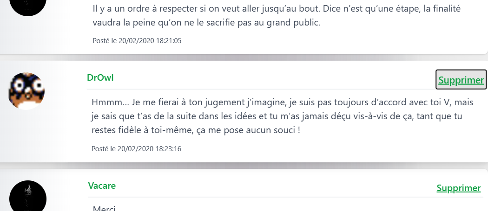

Puis de fournir la raison de cette suppression. Vous devrez également indiquer si vous voulez que ce message soit caché de tous ou non :

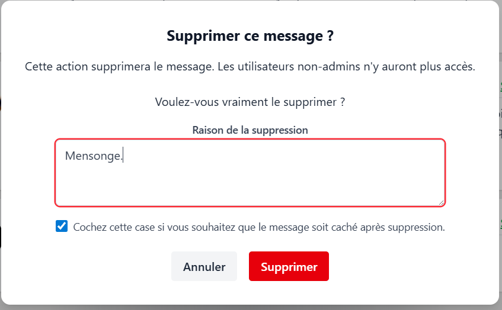

Vous pourrez voir les messages supprimés en tant qu'administrateur uniquement, tout en pouvant vérifier la raison de cette suppression :

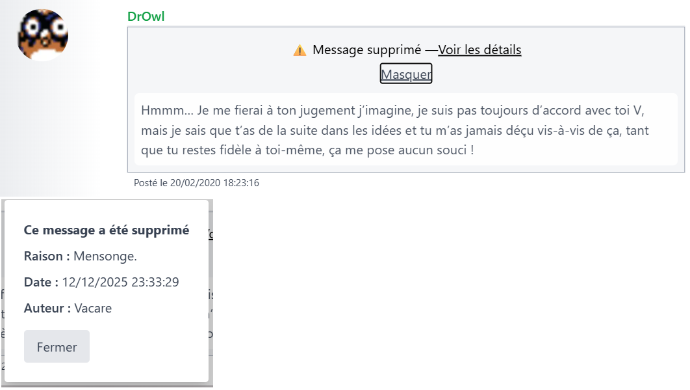

## Supprimer un blog ou un dossier (Admin)

Toujours administrateur et de la même façon, vous pourrez supprimer un blog voire un dossier entier si vous le souhaitez, ces derniers ne restant accessibles que de vous et des éventuels autres administrateurs du site.

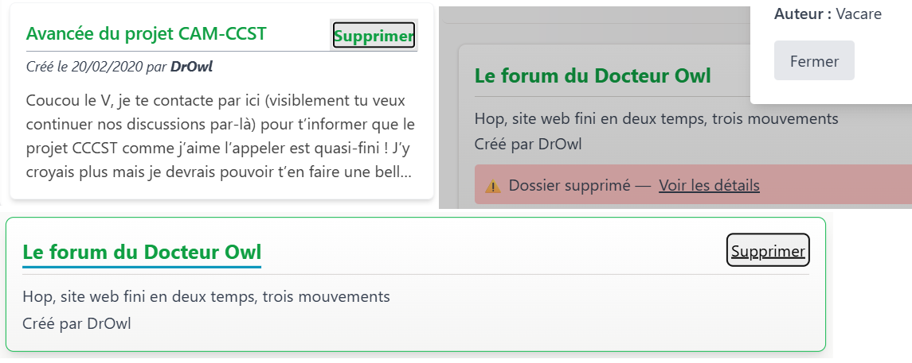

## Dernières remarques

Toutes les clefs entre vos mains, vous êtes désormais libres d'utiliser le site à votre guise !