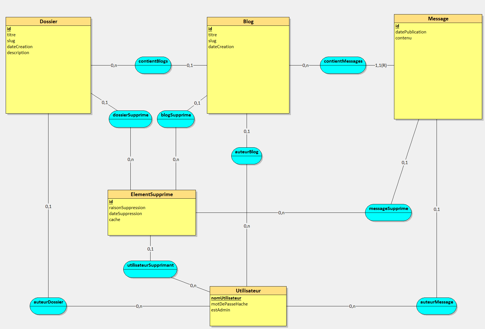

# Installation du projet 

# Mise en place de la Base de Données

Le choix de la base de données se fera dans la [Factory de services du backend](../../src/BlogVacare/backend/services/ServiceFactory.ts). Il vous suffira de décommenter la ligne correspondant à votre base de données et à commenter celle qui ne l'était pas au préalable.

La configuration diffèrera selon votre choix de Base de données : 
* [Configuration MySQL](BDD/MySQL.md)

## Modèle Conceptuel des Données

