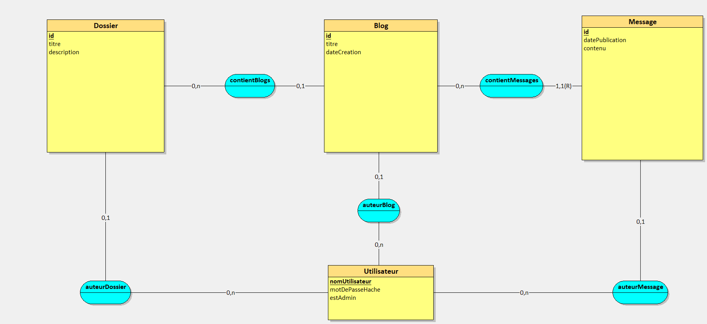

# Installation du projet 

# Configuration du projet

Pour configurer votre projet, commencez par créer un fichier [.env à partir de l'exemple fourni](../../src/BlogVacare/frontend/.env.sample), vous n'aurez qu'à configurer le lien du [backend](../../src/BlogVacare/backend/) du projet dans la ligne "NEXT_PUBLIC_LIEN_API_BACKEND".

Modes de fonctionnements du site (automatiquement configurés par [next.config.ts](../../src/BlogVacare/frontend/next.config.ts)): 
* **export** : 
  - Mode servant à l'exportation du site sous forme de pages HTML, nécessitant d'autres ajustements comme décrit ci-dessous (actuellement : connexion et inscription désactivés en mode exportation, le site est en "lecture seule")
  - Accessible via ```npm run build:export``` à la [racine du projet frontend](../../src/BlogVacare/frontend/), tout en ayant le backend actif et correctement lié
  - Votre projet devrait ensuite se trouver dans un dossier **out** sous forme de pages HTML.
* **Production** : 
  - Mode servant à l'hébergement du site de façon dynamique (interactions en direct avec le backend, ajout et suppression de contenu, ...)
  - Accessible via ```npm run "build:BlogVacare"``` puis ```npm run "start:BlogVacare"``` ou ```npm run "buildAndStart:BlogVacare"``` pour tout exécuter à la suite, ces commandes devant être exécutées à la [racine du dépôt](../../)

# Mise en place de la Base de Données

Le choix de la base de données se fera dans la [Factory de services du backend](../../src/BlogVacare/backend/services/ServiceFactory.ts). Il vous suffira de décommenter la ligne correspondant à votre base de données et à commenter celle qui ne l'était pas au préalable.

La configuration diffèrera selon votre choix de Base de données : 
* [Configuration MySQL](BDD/MySQL.md) ~ [Tests unitaires MySQL](BDD/TestsUnitairesMySQL.md)


## Modèle Conceptuel des Données

